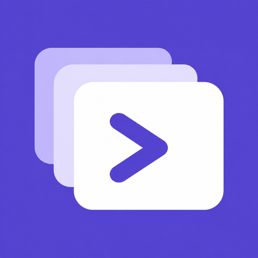
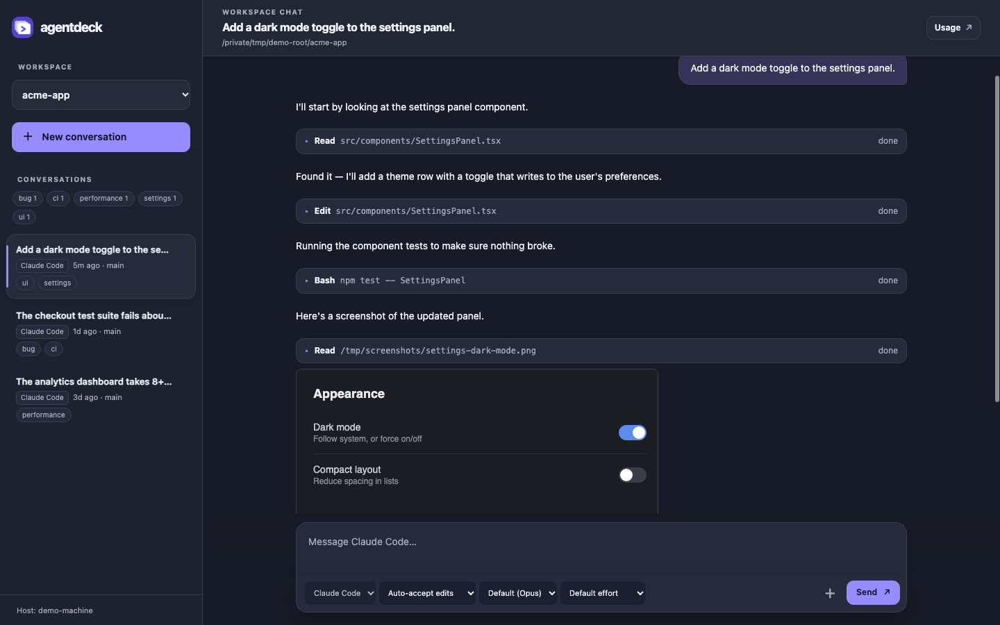

# agentdeck

A small web page for driving coding-agent conversations (Claude Code, Codex
and opencode) on this machine from any other device on your Tailscale network.

Your agents, your code, and the conversation history all stay on the host
machine — other laptops or phones just open a web page. Every device sees the
same live conversation, including streaming replies and permission prompts,
so you can start something on one laptop and approve or continue it from
another.

Conversations are each agent's own native sessions — Claude Code's in
`~/.claude/projects`, Codex's in `~/.codex`, opencode's in its own store — so
anything started in a terminal or desktop app shows up here too, and anything
started here can be resumed there (`claude --resume`, the Codex app or
`codex resume`, or the session list in opencode).



## Quick start

```bash
npm install
npm start
```

Requires Node 18+, and Claude Code logged in on the host — agentdeck uses
that login. Codex and opencode are optional: each one installed on the host
shows up as another agent, using its own login.

By default agentdeck listens on this machine's Tailscale IP, port 7878, so
only devices on your tailnet can reach it. On startup it prints the one
address to open on every device — its MagicDNS name,
`http://<machine-name>.<tailnet>.ts.net:7878`. Always include the `http://`
prefix. A bare IP, the short name, or `http://localhost:7878` on the host all
work too and send the page to that one name, because a browser approved under
one name would otherwise have to be approved again under the next (see
[Security](#security)).

The first time you open it, the page shows a code and waits for approval.
Run `npm run approve` in this folder on the host and type that code to let
the browser in.
After that, a new device can be approved from one you already use (see
[Security](#security)).

Port, project roots, an optional password, and other settings are environment
variables — see [docs/REFERENCE.md](docs/REFERENCE.md#environment-variables).

## Security

Anyone who can use this page can run commands on the host through the
agents, so each browser has to be approved once. A new browser shows a
short code and waits. Every device that already uses agentdeck gets a prompt
asking for that code; typing it there lets the new browser in. The code is
only ever shown on the new browser, so nobody can get approved by a tap on a
prompt you didn't expect. For the very first device, run `npm run approve` on
the host and type the code there. Approvals are
kept on the host, so restarts don't sign anyone out, and the page always
opens under one host name so a browser's approval keeps working. **Devices**, at the
bottom of the sidebar, lists them and removes any you no longer use. If a
`PASSWORD` is set, typing it also approves a browser.

agentdeck also refuses requests that a page from another site makes
through your browser, so a website you visit can't drive it. Keep it on a
private network like Tailscale all the same. See
[docs/REFERENCE.md](docs/REFERENCE.md#devices) for the details.

## Features

### Agents

The sidebar lists every agent's conversations for a project together, each
marked with its agent. When more than one agent is installed, a picker
chooses the agent for a new conversation; an existing conversation always
continues with the agent it started with. The mode, model and effort menus
adapt to show what the selected agent offers — see
[docs/REFERENCE.md](docs/REFERENCE.md#agent-modes) for what each agent's
modes mean. The **Usage** button in the header shows the plan limits of
whichever agent's login is active.

### Skills

Type `/` at the start of a message to list the skills and slash commands
the chat's agent has in this project: your own, the project's, plugins'
and the agent's built-in ones. Keep typing to filter, pick one with the
arrow keys and Enter (or Tab, or a click), add any arguments and send.
Typing `/name` yourself works the same as picking it. See
[docs/REFERENCE.md](docs/REFERENCE.md#skills) for how each agent runs them.

### Tags

Hover a conversation in the sidebar and click the tag button to add or
remove tags (up to 10, 30 characters each). Each change is saved as soon as
you make it. Tags you've used become **quick tags** you can toggle with one
click. The **Tags** section at the top of the
sidebar has a chip for every tag; click one to list that tag's
conversations from all workspaces. Tags live on the host and sync across every
device, but are never written into the agents' own transcripts.

### Images

Attach up to 10 images to a message — click 📎, paste, or drag files onto the
composer — and images the agent shares back (screenshots, tool output,
generated images) appear inline too, loaded from the host so every device
sees them. Click any image to view it full size. Videos (MP4, MOV, WebM)
and audio (MP3, M4A, WAV, Ogg, FLAC) the agent links, names or returns from
a tool play inline. See
[docs/REFERENCE.md](docs/REFERENCE.md#images) for how images and file-name
mentions are matched.

### Files

Drop any other file onto the composer (or pick it with ＋) and it's copied to
the host, and its path there is put into your message, so the agent can read
it. This works from any device, since a browser never tells the page where a
dropped file lives. See [docs/REFERENCE.md](docs/REFERENCE.md#files).

### Turns

One conversation runs one turn at a time. Messages sent while the agent is
working — from any device — wait in a queue shown above the composer and run
in order as each turn finishes. A queued message can be sent now (stopping
the current turn so it runs next), edited (taken back into the message box),
or removed before it starts. **Stop** ends the current
turn and clears the queue, putting the queued messages back into the message
box of the device that pressed it. Permission
prompts (file edits, shell commands, plan approval, questions) appear on
every connected device, and whichever answers first wins. Avoid keeping the
same conversation open here and in a terminal, desktop app, or opencode TUI
at the same time — each keeps its own copy in memory and won't see the
other's messages.

### Forks

Hover any message you sent and click the fork button beside it to branch the
conversation: the host copies it, through the end of that exchange, into a
new conversation of the same agent, which then opens. Forking from the last
message copies the whole conversation. A branch is one of the agent's own
sessions, so it resumes in a terminal too, and it starts with the model,
effort, mode and tags of the chat it came from. The fork button is hidden
while a turn is running, because the transcript is still being written.

### Moving a chat

A chat that ended up in the wrong workspace, or that started under `~/code`
and made a new repo there, can move. **Move…** next to the folder under the
chat's title opens a dialog: pick a workspace or type a folder, read what
goes where, and press Move. The chat keeps its history, tags and settings,
is listed under the new workspace, and its next message runs there. When a
turn makes a new folder under the project roots, a card offers to move the
chat to it; nothing moves until you confirm. Move is hidden while a turn is
running. How each agent does it is in
[docs/REFERENCE.md](docs/REFERENCE.md#moving-a-chat).

### Workspace index

Every new conversation, with any agent, starts knowing which projects are
on this machine: each folder under the project roots with its path, the
opening paragraph of its README, when it was last active and the titles of
its latest chats from all three agents. Ask about another repo by name and the
agent knows where to look, and agentdeck offers to add that repo to the
chat's folders (see [Folders](#folders)). Chat titles are often the start
of a chat's first message, so whatever you typed there goes to the provider
of every new chat. Set `WORKSPACE_INDEX=off` to turn it off — see
[docs/REFERENCE.md](docs/REFERENCE.md#workspace-index).

### Just ask

**Just ask** in the sidebar takes a task with no workspace picked. A quick
call to a cheap model (Sonnet, by default) reads the workspace index and
names the project the task is about; the page then opens a new chat there
and sends the task as typed, with the agent, model and mode the composer
shows. The chat starts with a line saying which project was picked and why.
When no project fits, or the guess is a weak one, the task stays in the
composer for you to place. See
[docs/REFERENCE.md](docs/REFERENCE.md#just-ask).

### Folders

A chat works in its project folder, and can work in other folders too. The
📁 button in the composer lists them: pick projects to add, or type any
folder's path, and remove them with ×. When a message names another project
under the project roots, by name or path, a prompt asks whether to add it to
the chat. Each project is asked about once per chat. Allow it and the agent
can read and edit there without asking for access first, in this and later
turns. The chat's mode still decides which actions need approval. A chat's
folders are kept with its model and mode, so every device continues it the
same way. See [docs/REFERENCE.md](docs/REFERENCE.md#extra-folders) for what
each agent does with them.

### Sounds

A soft two-note chime plays when a conversation finishes a turn, and a more
insistent double beep when a permission prompt appears. Both play for every
conversation on the host, not just the one you have open, so a chat left
running in another workspace still calls out. The bell button in the header
mutes them, per device. Browsers only allow sound after you've interacted
with the page, so the first click or key press after opening arms it.

### Stats

**Stats**, at the bottom of the sidebar, opens a usage page built from what
the agents already keep on disk: activity over time as prompts per day
stacked by agent, a weekday-by-hour heatmap of when you work, replies or
output tokens per model (a switch on the card) and prompts per project, with
tiles for conversations, prompts, tokens generated and active days in the
chosen range. Filter by range (7/30/90 days
or all time) or by agent; every chart also has a table view. It covers all
chats on the machine, not just ones started in agentdeck. The first scan
reads every transcript and can take a few seconds; after that only changed
files are read. See [docs/REFERENCE.md](docs/REFERENCE.md#stats).

### Quick actions

The header ends with one-click buttons that run on the host. **Restart** is
built in: it restarts agentdeck itself, which is how to pick up a change an
agent just made to agentdeck's own code without going to a terminal. Every
open page shows "Restarting…" and reloads when the server is back; a message
you were typing comes back with it. If any conversation is mid-turn, the
button asks first, because a restart stops those turns.

**Settings**, at the bottom of the sidebar, adds your own buttons (macros):
a label, an optional emoji, and a shell command that runs on the host in the
open workspace's folder. Each one shows what it printed in a card above the
composer, and can restart agentdeck once it succeeds, for an "update and
restart" button. The list is kept on the host, so every device shows the
same buttons; on a phone, Restart stays in the header and ⚡ opens the rest.
See [docs/REFERENCE.md](docs/REFERENCE.md#quick-actions) for how the
restart works under a LaunchAgent or when started by hand.

Shell code blocks in a reply (tagged `bash`, `sh`, `console` and the like)
have a **Run** button. It asks first, showing the command and the
folder, then runs it on the host in the chat's folder and shows what it
printed in the same kind of card. In a block with `$ ` prompts only those
lines run; the rest is taken as output.

If [Tool Hub](https://github.com/yuanyang7/tool-hub) is running on the host
and knows the open workspace, the header also shows a **project bar** for
its dev server: a dot that is green while it runs, **Open** to visit it,
**Restart** to restart it through the hub (asking first, then showing the
hub's answer in a card like a quick action's), and **Hub** to open the
project in Tool Hub. Links use whatever host name the page was opened with,
so they work from a phone on the tailnet too. On a phone the bar is just
the dot; tap it for the three actions. Without a hub nothing is shown. See
[docs/REFERENCE.md](docs/REFERENCE.md#tool-hub).

If the workspace is enrolled in
[feedback-loop](https://github.com/yuanyang7/feedback-loop) (it, or its repo,
has `.feedback-loop/config.yml`), the bar also shows its bug queue, such as
"🐞 2 need you", which opens the feedback dashboard, and **Report**, which
files a bug as a GitHub issue for an agent to fix, optionally cleared for it
to start on its own. This works whether or not Tool Hub knows the project.
See [docs/REFERENCE.md](docs/REFERENCE.md#feedback-loop).

## More

[docs/REFERENCE.md](docs/REFERENCE.md) covers:

- All environment variables
- What each agent's permission modes mean
- How image and file-mention matching works
- Code layout, for hacking on agentdeck itself
- Running agentdeck at login (LaunchAgent), and troubleshooting

This project is MIT licensed — see [LICENSE](LICENSE).
